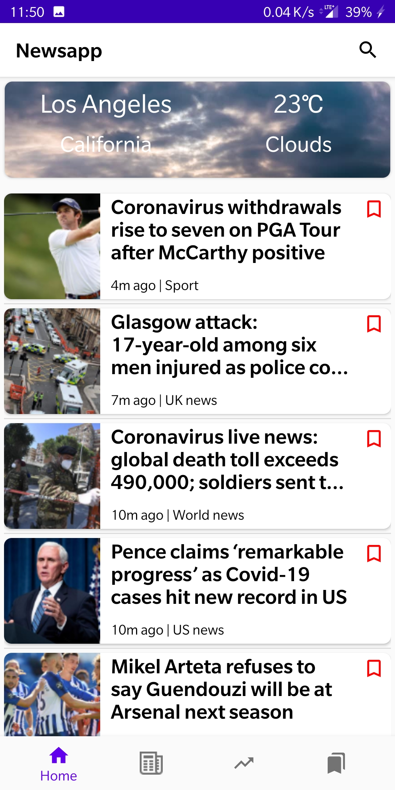

# Android-News-App

This is an Android application which allows users to search for latest news provided by Guardian News, look at detailed information about these headlines, bookmark them and share on Twitter. This project is essentially an extension to the react news app I developed: <a href="https://github.com/likhitasuresh/React-News-App">Link to project</a>. There are two main additional features in this app- to display weather information for current location and to plot frequency vs year charts for specific keywords.

Dated: May 2020

## **Functionality**
* The application has pages with top news headlines, news headlines segregrated by domain and frequency chart for a specific keyword.
* Multiple pure android components like tab layout, fragments, graph view, and recycler view were used in this project. 
* This project is powered by Guardian News API for headlines and Open Weather Map API for weather conditions of current location.
* This app also provides the search functionality to find articles related to a particular keyword.

Attached are screenshots from the application:

</img>

*Page after splash screen with top headlines and weather of current location*

</img>

*A tab layout of headlines segregated according to their domain*

 

*Detalied article page*

 

*Page with frequency chart of specific keyword*

*Page with bookmarked articles*
